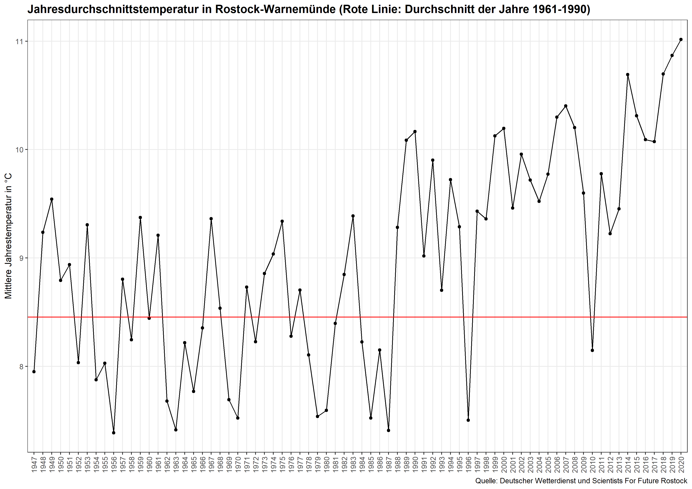

```{r setup, include=FALSE}
knitr::opts_chunk$set(
  echo = TRUE,
  fig.path = "man/figures/",
  comment = "#>"
)
```

## climateStripes

R package to create diagrams that show the impact of climate change.
It started with an R function to plot Warming Stripes which were inspired by Ed Hawkins.
The R package can now fetch data from Deutscher Wetterdienst (DWD) and plot:

* [Warming Stripes](#warming-stripes) (annual deviation from the average temperature in the years 1961-1990 as colored bars)
* [Precipitation Stripes](#precipitation-stripes) (annual deviation from the average total precipitation in the years 1961-1990 as colored bars)
* [Wind Speed Stripes](#wind-speed-stripes) (annual deviation from the average wind speed in the years 1961-1990 as colored bars)
* [Sunshine Duration Stripes](#precipitation-stripes) (annual deviation from the average daily sunshine duration in the years 1961-1990 as colored bars)

(Most recent additions may be found in the develop-branch.)

### How to install the package and use it

In order to create all possible plots for the DWD station in Rostock, one needs to download the package and execute the following lines of code in R:


```r
library(devtools)
install()
require("climateStripes")
climateStripes(city.name = "rostock")
```

### Examples: How to create different climate plots

#### Warming Stripes

```r
library(devtools)
install()
require("climateStripes")
climateStripes(city.name = "rostock", plot.what = "warmingstripes")
```

```{r, out.width='100%', fig.align='center', fig.cap='', echo=FALSE}


```

#### Precipitation Stripes

```r
library(devtools)
install()
require("climateStripes")
climateStripes(city.name = "rostock", plot.what = "precipitationstripes")
```

```{r, out.width='100%', fig.align='center', fig.cap='', echo=FALSE}
knitr::include_graphics("man/figures/PrecipitationStripes.png")
knitr::include_graphics("man/figures/PrecipitationPoints.png")
```

#### Wind Speed Stripes

```r
library(devtools)
install()
require("climateStripes")
climateStripes(city.name = "rostock", plot.what = "windspeedstripes")
```

```{r, out.width='100%', fig.align='center', fig.cap='', echo=FALSE}
knitr::include_graphics("man/figures/WindspeedStripes.png")
knitr::include_graphics("man/figures/WindspeedPoints.png")
```

#### Sunshine Duration Stripes

```r
library(devtools)
install()
require("climateStripes")
climateStripes(city.name = "rostock", plot.what = "sunshinedurationstripes")
```

```{r, out.width='100%', fig.align='center', fig.cap='', echo=FALSE}
knitr::include_graphics("man/figures/SunshineStripes.png")
knitr::include_graphics("man/figures/SunshinePoints.png")
```
